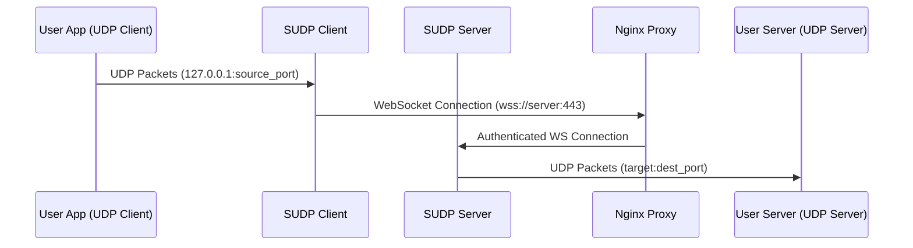
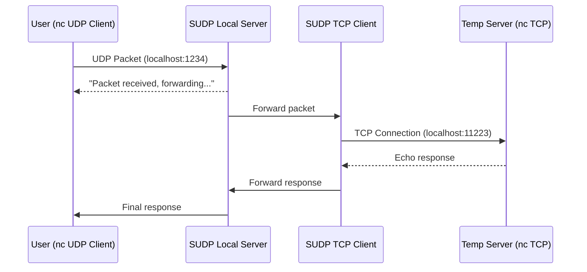

# SUDP User Story

## Overview

SUDP enables secure transmission of UDP packets over WebSocket connections, allowing UDP-based applications to communicate securely across the internet, even through firewalls and NAT.

## Operation Flow



### 1. Client Side
1. User's application sends UDP packets to a local port (e.g., 127.0.0.1:5005)
2. SUDP Client listens on this port for incoming UDP packets
3. When a packet is received, the client:
   - Encapsulates the UDP packet with metadata
   - Establishes a secure WebSocket connection (if not already connected)
   - Transmits the encapsulated packet through the WebSocket

### 2. Server Side
1. Nginx handles incoming WebSocket connections:
   - Terminates SSL/TLS
   - Performs authentication
   - Forwards valid connections to SUDP Server
2. SUDP Server:
   - Receives encapsulated packets
   - Extracts the original UDP packet
   - Forwards to the configured destination UDP server

## Testing Scenarios

### 1. Basic UDP Communication Test
```bash
# Terminal 1 - Simulate destination UDP server
nc -ul 127.0.0.1 5006  # Listen for UDP on port 5006

# Terminal 2 - Start SUDP server
sudp-server --listen 8080 --forward 127.0.0.1:5006

# Terminal 3 - Start SUDP client
sudp-client --listen 5005 --connect ws://127.0.0.1:8080

# Terminal 4 - Simulate UDP client application
nc -u 127.0.0.1 5005  # Send UDP packets to SUDP client
```

### 2. Production Setup
```bash
# Server Side (example.com)
# 1. Configure Nginx
server {
    listen 443 ssl;
    server_name example.com;

    ssl_certificate /path/to/cert.pem;
    ssl_certificate_key /path/to/key.pem;

    location /sudp {
        auth_basic "SUDP Access";
        auth_basic_user_file /etc/nginx/.htpasswd;
        
        proxy_pass http://localhost:8080;
        proxy_http_version 1.1;
        proxy_set_header Upgrade $http_upgrade;
        proxy_set_header Connection "upgrade";
    }
}

# 2. Start SUDP server
sudp-server --listen 8080 --forward target-server:5001

# Client Side
# Start SUDP client with authentication
sudp-client --listen 5000 \
           --connect wss://example.com/sudp \
           --auth username:password
```

## Example Use Cases

### 1. Game Server Connection
- Game client sends UDP packets to `localhost:5000`
- SUDP client forwards through secure WebSocket
- SUDP server delivers to actual game server
- Enables secure, firewall-friendly game connections

### 2. VoIP Application
- VoIP app sends UDP voice packets to `localhost:5060`
- SUDP provides secure transport across the internet
- Maintains low latency while adding security

### 3. IoT Data Collection
- IoT devices send UDP telemetry to local SUDP client
- Data is securely forwarded to central collection server
- Provides secure channel for typically insecure UDP data

## Configuration Examples

### 1. Client Configuration
```yaml
listen:
  address: 127.0.0.1
  port: 5000

websocket:
  url: wss://example.com/sudp
  auth:
    username: client1
    password: secret

buffer:
  size: 65507  # Max UDP packet size
  timeout: 30  # Connection timeout in seconds
```

### 2. Server Configuration
```yaml
listen:
  address: 127.0.0.1
  port: 8080

forward:
  address: target-server.com
  port: 5001

security:
  max_clients: 100
  rate_limit: 1000  # packets per second
```

## Testing Checklist

1. [ ] Basic UDP packet forwarding
   - Use netcat to verify basic functionality
   - Test with various packet sizes
   - Measure latency

2. [ ] WebSocket connection
   - Test connection establishment
   - Verify reconnection handling
   - Check SSL/TLS functionality

3. [ ] Authentication
   - Verify Nginx auth
   - Test invalid credentials
   - Check connection security

4. [ ] Performance
   - Test with high packet rates
   - Monitor memory usage
   - Verify no packet loss 

## Initial Testing Scenario

### Overview

This scenario demonstrates the basic packet flow using netcat for testing both UDP and TCP components:



### Test Setup

1. Start a temporary TCP server using netcat:
```bash
# Terminal 1 - TCP Server (temporary stand-in for SUDP server)
nc -l 11223
```

2. Start the SUDP client:
```bash
# Terminal 2 - SUDP Client
python -m src.client --udp-port 1234 --server-port 11223
```

3. Send UDP packets using netcat:
```bash
# Terminal 3 - UDP Client
nc -u localhost 1234
```

### Expected Behavior

1. UDP Client -> Local Server:
   - User types message in UDP client (nc)
   - Local server receives UDP packet
   - Local server sends acknowledgment back to UDP client
   - Message: "Packet received, forwarding to server..."

2. Local Server -> TCP Client:
   - Local server forwards packet to TCP client
   - TCP client establishes connection to temporary TCP server
   - TCP client serializes and sends packet

3. TCP Server -> TCP Client:
   - Temporary TCP server (nc) echoes the packet back
   - TCP client receives and deserializes response
   - TCP client forwards to local server

4. Local Server -> UDP Client:
   - Local server sends final response to original UDP client
   - User sees both acknowledgment and final response

### Example Session

```
# Terminal 1 (TCP Server - nc -l 11223)
> Waiting for connection...
> Received: "Hello, World!"
> Echoing back...

# Terminal 2 (SUDP Client)
> Starting SUDP client...
> Local UDP server listening on 127.0.0.1:1234
> TCP client connected to 127.0.0.1:11223
> Received UDP packet: "Hello, World!"
> Forwarding to server...
> Received server response
> Sending response to UDP client

# Terminal 3 (UDP Client - nc -u localhost 1234)
> Hello, World!
< Packet received, forwarding to server...
< Echo: Hello, World!
```

## Development Steps

1. Client-Side Implementation:
   - [x] UDP Server (src/client/local_server.py)
   - [x] TCP Client (src/client/tcp_client.py)
   - [x] Main Client (src/client/client.py)

2. Initial Server Testing:
   - [ ] Use netcat as temporary TCP server
   - [ ] Verify packet flow and responses
   - [ ] Test connection handling

3. Server-Side Implementation:
   - [ ] TCP Server (src/server/tcp_server.py)
   - [ ] UDP Client (src/server/udp_client.py)
   - [ ] Main Server (src/server/server.py)

4. Integration Testing:
   - [ ] Replace netcat server with SUDP server
   - [ ] Test full packet flow
   - [ ] Verify metrics and logging

## Next Steps

1. Implement basic TCP server to replace netcat:
   - Listen on configured port
   - Accept TCP connections
   - Echo received packets
   - Log operations

2. Test server implementation:
   - Verify connection handling
   - Test packet serialization
   - Validate responses

3. Develop full server components:
   - TCP listener for client connections
   - UDP client for forwarding
   - Proper packet handling

## Notes

1. Port Usage:
   - UDP Client (netcat): Any port
   - Local UDP Server: 1234
   - TCP Client -> Server: 11223
   - Final UDP Destination: TBD

2. Testing Considerations:
   - Use `nc` without DNS lookups
   - Keep packet size small initially
   - Monitor with Wireshark if needed

3. Development Guidelines:
   - Start with basic echo functionality
   - Add features incrementally
   - Test each component separately 