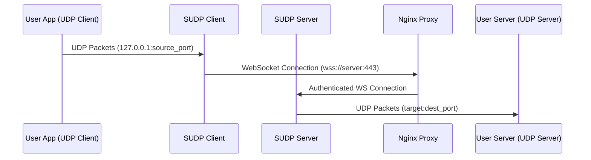

# SUDP User Story

## Overview

SUDP enables secure transmission of UDP packets over WebSocket connections, allowing UDP-based applications to communicate securely across the internet, even through firewalls and NAT.

## Operation Flow



### 1. Client Side
1. User's application sends UDP packets to a local port (e.g., 127.0.0.1:5005)
2. SUDP Client listens on this port for incoming UDP packets
3. When a packet is received, the client:
   - Encapsulates the UDP packet with metadata
   - Establishes a secure WebSocket connection (if not already connected)
   - Transmits the encapsulated packet through the WebSocket

### 2. Server Side
1. Nginx handles incoming WebSocket connections:
   - Terminates SSL/TLS
   - Performs authentication
   - Forwards valid connections to SUDP Server
2. SUDP Server:
   - Receives encapsulated packets
   - Extracts the original UDP packet
   - Forwards to the configured destination UDP server

## Testing Scenarios

### 1. Basic UDP Communication Test
```bash
# Terminal 1 - Simulate destination UDP server
nc -ul 127.0.0.1 5006  # Listen for UDP on port 5006

# Terminal 2 - Start SUDP server
sudp-server --listen 8080 --forward 127.0.0.1:5006

# Terminal 3 - Start SUDP client
sudp-client --listen 5005 --connect ws://127.0.0.1:8080

# Terminal 4 - Simulate UDP client application
nc -u 127.0.0.1 5005  # Send UDP packets to SUDP client
```

### 2. Production Setup
```bash
# Server Side (example.com)
# 1. Configure Nginx
server {
    listen 443 ssl;
    server_name example.com;

    ssl_certificate /path/to/cert.pem;
    ssl_certificate_key /path/to/key.pem;

    location /sudp {
        auth_basic "SUDP Access";
        auth_basic_user_file /etc/nginx/.htpasswd;
        
        proxy_pass http://localhost:8080;
        proxy_http_version 1.1;
        proxy_set_header Upgrade $http_upgrade;
        proxy_set_header Connection "upgrade";
    }
}

# 2. Start SUDP server
sudp-server --listen 8080 --forward target-server:5001

# Client Side
# Start SUDP client with authentication
sudp-client --listen 5000 \
           --connect wss://example.com/sudp \
           --auth username:password
```

## Example Use Cases

### 1. Game Server Connection
- Game client sends UDP packets to `localhost:5000`
- SUDP client forwards through secure WebSocket
- SUDP server delivers to actual game server
- Enables secure, firewall-friendly game connections

### 2. VoIP Application
- VoIP app sends UDP voice packets to `localhost:5060`
- SUDP provides secure transport across the internet
- Maintains low latency while adding security

### 3. IoT Data Collection
- IoT devices send UDP telemetry to local SUDP client
- Data is securely forwarded to central collection server
- Provides secure channel for typically insecure UDP data

## Configuration Examples

### 1. Client Configuration
```yaml
listen:
  address: 127.0.0.1
  port: 5000

websocket:
  url: wss://example.com/sudp
  auth:
    username: client1
    password: secret

buffer:
  size: 65507  # Max UDP packet size
  timeout: 30  # Connection timeout in seconds
```

### 2. Server Configuration
```yaml
listen:
  address: 127.0.0.1
  port: 8080

forward:
  address: target-server.com
  port: 5001

security:
  max_clients: 100
  rate_limit: 1000  # packets per second
```

## Testing Checklist

1. [ ] Basic UDP packet forwarding
   - Use netcat to verify basic functionality
   - Test with various packet sizes
   - Measure latency

2. [ ] WebSocket connection
   - Test connection establishment
   - Verify reconnection handling
   - Check SSL/TLS functionality

3. [ ] Authentication
   - Verify Nginx auth
   - Test invalid credentials
   - Check connection security

4. [ ] Performance
   - Test with high packet rates
   - Monitor memory usage
   - Verify no packet loss 